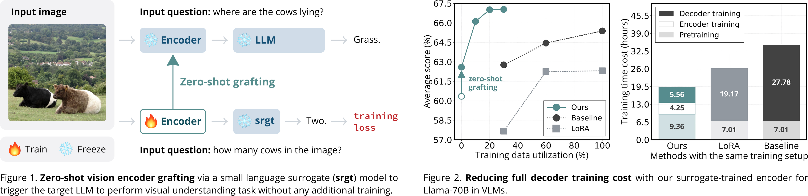
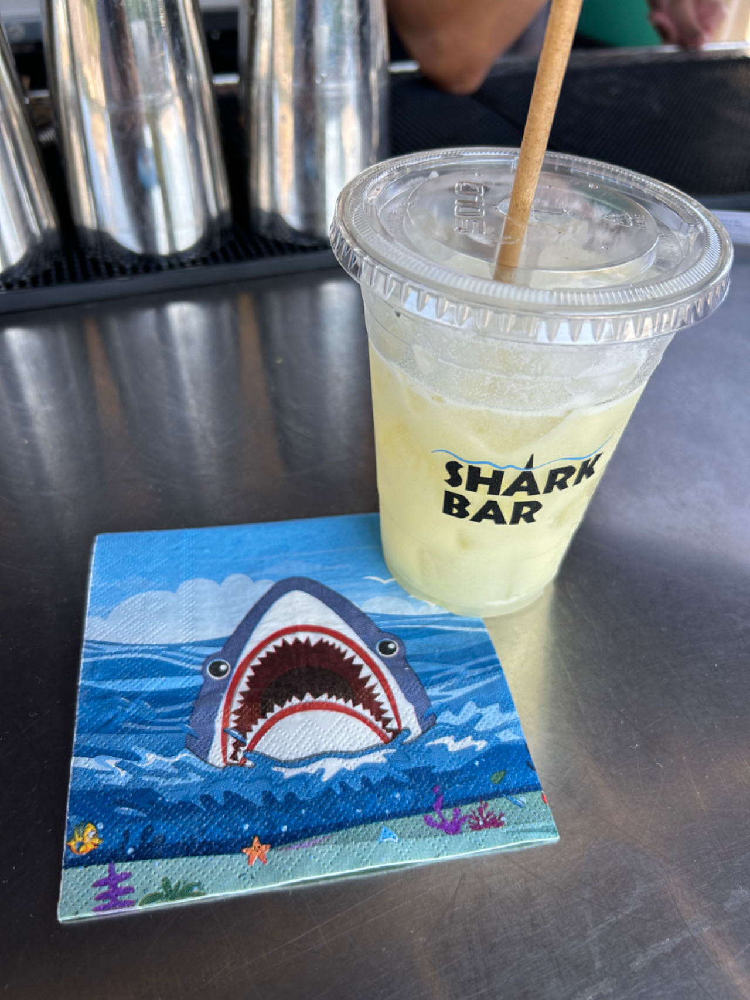
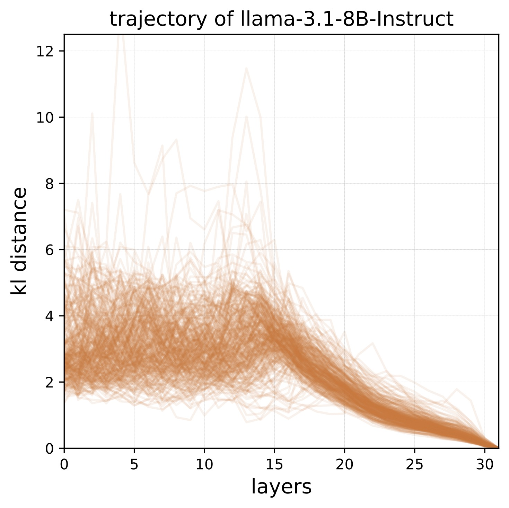
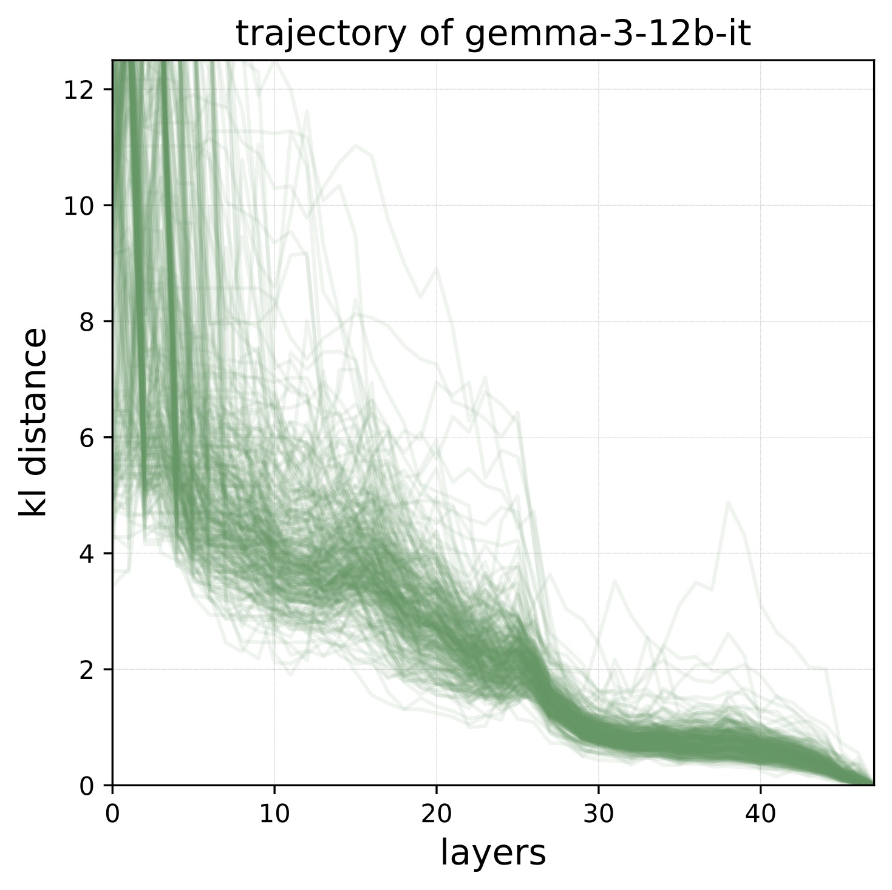
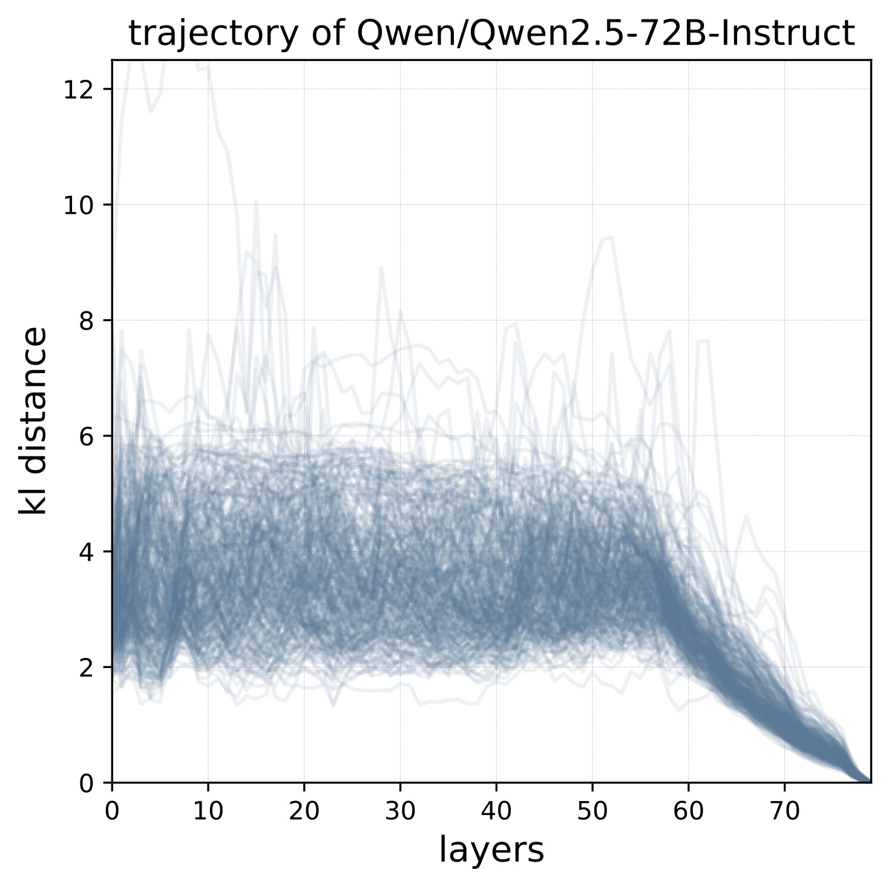

## Zero-Shot Vision Encoder Grafting via LLM Surrogates

*International Conference on Computer Vision (ICCV), 2025* :hibiscus:

<br>

The code is minimally :bubbles: structured for general language and vision-language model training, with torch FSDP/DDP in a single `train.py` file.
Models are loaded from [transformers](https://github.com/huggingface/transformers).
Evaluation is supported on [vLLM](https://github.com/vllm-project/vllm) with tensor parallelism via `torchrun`, directly calling [lmms-eval](https://github.com/EvolvingLMMs-Lab/lmms-eval) and [lm-evaluation-harness](https://github.com/EleutherAI/lm-evaluation-harness) through their APIs.

<br>
<p align="center">
    
</p>

## Table of Contents

- [Dependencies](#dependencies)
- [Preparing](#preparing)
- [`cd ./src`](#cd-src)
- [Inference](#inference)
- [Training](#training)
- [Evaluation](#evaluation)
- [Integrating New Models](#integrating-new-models)
- [Plotting Prediction Trajectory](#plotting-prediction-trajectory)
- [License](#license)
- [Acknowledgements](#acknowledgements)


## Dependencies

```bash
pip install -r requirements.txt
```

Experiments in the paper use `torch==2.5.1` and `transformers==4.45.2`.
The code works with their latest versions, as no changes are made to the original source code. 
Feel free to use latest versions.

The default attention implementation is `sdpa`.
To use `flash_attention_2` instead, please `pip install flash-attn --no-build-isolation` following [transformers-flash-attention](https://huggingface.co/docs/transformers/main/en/perf_infer_gpu_one#flashattention).

The default sampling engine uses `transformers`. 
For fast sampling with `vllm`, please install it following [instructions](https://docs.vllm.ai/en/latest/getting_started/installation.html).
Note: `vllm >=0.9.0` is required to support prompt embeddings input to the vllm model.

```bash
# [option 1] install via pip
pip install vllm==0.9.0  # or later

# [option 2] install from nightly build
pip install -U vllm --pre --extra-index-url https://wheels.vllm.ai/nightly
```

## Preparing

#### :paw_prints: Paths

The main workspace is `dev_root/proj_tag` set in the [`src/configs/config_base.py#L22-L24`](src/configs/config_base.py#L22-L24) file.

```python
# hparams for directories 
dev_root: str = osp.join(os.environ["HOME"], "dev") 
proj_tag: str = "zero" 
```

The default `dev_root` is `${HOME}/dev`, where a project folder `${proj_tag}` will be created. 
This project folder will contain subfolders for cache, data, checkpoints, and evaluation results.

```bash
${dev_root}:
|--${proj_tag}:
    |--cache
    |--checkpoints
    |--data
    |--results
```

Please set `dev_root` to a valid path in `config_base.py` before running the code.
If you prefer a different structure, you can modify each subfolder path in the config file.

#### :paw_prints: Huggingface Login

Please log in to huggingface before running the code using [huggingface-cli login](https://huggingface.co/docs/huggingface_hub/en/guides/cli#command-line-interface-cli).
After login, please set `HF_HOME` to environment:

```bash
export HF_HOME=${PATH TO THE FOLDER OF HF TOKEN FILE}
```

All huggingface models and datasets will be cached in the `cache/huggingface` folder.

```bash
${dev_root}:
|--${proj_tag}:
    |--cache
        |--huggingface
```

## `cd ./src`

`cd src` when running the commands.

## Inference

When running inference scripts for the first time, checkpoints will be ***automatically*** downloaded to the `checkpoints` folder.

```bash
${dev_root}:
|--${proj_tag}:
    |--checkpoints
        |--llama3.1-70b_adapter_translator
        |--llama3.1-70b_surrogate-trained-encoder
        |--llama3.1-8b_adapter_translator
        |--llama3.1-8b_surrogate-trained-encoder
        |--llama3.2-3b_adapter_translator
        |--llama3.2-3b_surrogate-trained-encoder
```

| checkpoints | :hugs: hf model repo | license |
|:--:|:--:|:--:|
| translators and surrogate-trained vision encoders | [`link`](https://huggingface.co/tomg-group-umd/zero-model-checkpoints) | [CC-BY-NC 4.0](LICENSE) |

#### :paw_prints: Running Vision-Language Models

This inference demonstrates zero-shot grafting ability of our surrogate-trained vision encoders onto full-size Llama models.
All commands can run on a single or multiple GPUs. 
The results shown are generated using a single NVIDIA RTX A5000 with 23.9GB GPU memory and 128GB CPU memory.

```bash
# llama-3.2 3B
./scripts/run inference/vlm_infer.py configs/zero/infer_llama_3b.py

# llama-3.1 8B
./scripts/run inference/vlm_infer.py configs/zero/infer_llama_8b.py

# llama-3.1 70B
python3 inference/vlm_infer.py configs/zero/infer_llama_70b.py
```

**Note**:
To run Llama-70B inference, use `python3`. 
The model will automatically shard across all available GPUs. 
If there aren’t enough GPUs, CPU offloading will be applied.
For more details, see [HF - Big Model Inference](https://huggingface.co/docs/accelerate/en/concept_guides/big_model_inference).

The default input image is `.github/shark.jpg`, and input question is `What is the text in the image? And where is it?`.
After running the above commands, output responses are:

<table style="vertical-align: top;">
    <tr>
    <td><b>image</b></td>
    <td><b>output</b></td>
    </tr>
    <tr>
    <td style="vertical-align: top;">
        <p style="text-align: center;">
            
        </p>
    </td>
    <td style="vertical-align: top;">
        <p><li>llama-3.2 3B</li>The text in the image is "Shark". It is located on a cup.</p>
        <p><li>llama-3.2 8B</li>The text in the image is "Shark Bar" and it is located at the top of the image.</p>
        <p><li>llama-3.2 70B</li>The text in the image is "Shark Bar" and it is located on the side of the cup.</p>
    </td>
    </tr>
</table>

#### :paw_prints: Running Language Models

To infer small surrogate language models or full-size language models, run:

```bash
# llama-3.2 3B
./scripts/run inference/llm_infer.py configs/zero/infer_llama_3b.py

# llama-3.1 8B
./scripts/run inference/llm_infer.py configs/zero/infer_llama_8b.py

# llama-3.1 70B
python3 inference/llm_infer.py configs/zero/infer_llama_70b.py
```

## Training

This part demonstrates how to train language models and vision-language models on single or multiple nodes.

#### :paw_prints: Datasets

**1. LLaVA-1.5-665K-Instructions**

We gather the entire LLaVA-1.5-665K-Instructions, including images and text sequences, into a single [HF repo - llava-1.5-665k-instructions](https://huggingface.co/datasets/kaiyuyue/llava-1.5-665k-instructions).
Please download the dataset and organize it as follows:

```bash
${dev_root}:
|--${proj_tag}:
    |--data
        |--llava-1.5-665k-instructions
            |--train_split
                |--coco
                    |--train2017
                    |--val2017
                |--vg
                |--gqa
                |--ocr_vqa
                |--textvqa
            |--llava_v1_5_mix665k.json
            |--llava_v1_5_mix665k_shuffled.json
            |--llava_v1_5_mix665k_shuffled_full.json    
```

The dataset is registered in [`src/loader.py#L22-L39`](src/loader.py#L22-L39).

**2. GenQA-500K-Text-Instructions**

We randomly sample 500K text-only instructions from [GenQA](https://huggingface.co/datasets/tomg-group-umd/GenQA), and mix them with [LLaVA-1.5-665K-Instructions](https://huggingface.co/datasets/kaiyuyue/llava-1.5-665k-instructions) for the 1st stage training, where we train the vision adapter in encoder and the translator in surrogate decoder. 

The json file can be downloaded from the HF dataset repo - [llava-1.5-665k-genqa-500k-instructions](https://huggingface.co/datasets/kaiyuyue/llava-1.5-665k-genqa-500k-instructions).
Or it can be also created by running the following script:

```bash
./../tools/mix_genqa-500k_llava-665k.py \
    --hf-cache-dir ${path to cache/huggingface/datasets/} \
    --llava-665k-path ${path to zero/data/llava-1.5-665k-instructions/llava_v1_5_mix665k_shuffled.json} \
    --save-fold ${path to zero/data/llava-1.5-665k-genqa-500k-instructions}
```

**3. Bring Your Own Dataset**

Follow the same structure above to prepare your dataset, including the image folder and JSON file.
Then register the dataset in [`src/loader.py#L22-L39`](src/loader.py#L22-L39).

To use the absolute full path of the image, simply add the `full_path` key in the JSON file, see [`src/loader.py#L158-L161`](src/loader.py#L158-L161).

To skip the image processor in the loader and make the loader return raw PIL images, please set `cfg.simple_raw_image_mode = bool(1)` in the config file, see [`src/loader.py#L131`](src/loader.py#L131).

In default, we disable on-the-fly shuffling to ensure reproducibility with a fixed data order.
Instead, we pre-shuffle each source dataset and mix them using evenly spaced insertion based on dataset sizes.
See [`tools/mix_genqa-500k_llava-665k.py`](tools/mix_genqa-500k_llava-665k.py) for details.

#### :paw_prints: Saving Checkpoints 

PyTorch saves full model parameters by default, which is unnecessary when training only part of the model. 
To prevent cpu OOM issues for saving checkpoints, especially with large models like LLaMA-70B, we save only the updated parameters. 
Since PyTorch lacks this feature, we manually modify a function in its source code if needed for the machine without large cpu memory.

First, find the conda path to the torch package, for example

```bash
miniconda3/envs/zero/lib/python3.11/site-packages/torch/distributed/fsdp/_state_dict_utils.py
```

Then, in the function `_full_post_state_dict_hook`, modify the sub-function `def param_hook` as follows:

```python
...

def param_hook(
    state_dict: Dict[str, Any],
    prefix: str,
    fqn: str,
) -> None:
    clean_key = fqn
    clean_prefix = clean_tensor_name(prefix)
    # Strip prefix out of key if needed as buffer names and param names
    # do not have prefix considered as they are not computed in `state_dict`
    # call.
    if clean_key.startswith(clean_prefix):
        clean_key = clean_key[len(clean_prefix) :]

    # Hack to only save trainable params
    need_to_clone = False
    for n, p in module.named_parameters():
        n = clean_tensor_name(n)
        if p.requires_grad and n in fqn:
            need_to_clone = True
            break

    # Clone parameters before exiting the `_unshard_fsdp_state_params()` context.
    if not getattr(state_dict[fqn], "_has_been_cloned", False):
        try:
            if need_to_clone:
                state_dict[fqn] = state_dict[fqn].clone().detach()
                state_dict[fqn]._has_been_cloned = True  # type: ignore[attr-defined]
                print(f"fsdp:_state_dict_utils: clone {fqn}")
            else:
                state_dict[fqn]._has_been_cloned = False

        except BaseException as e:
            warnings.warn(
                f"Failed to clone() tensor with name {fqn} on rank {fsdp_state.rank}. "
                "This may mean that this state_dict entry could point to invalid "
                "memory regions after returning from state_dict() call if this "
                "parameter is managed by FSDP. Please check clone "
                f"implementation of {fqn}. Error: {str(e)}"
            )
...
```

#### :paw_prints: Training

```bash
# with single node
./scripts/run train.py configs/zero/train_llama.py  # or configs/zero/train_llama_lang.py for training language models

# with multiple nodes
./scripts/run_dist train.py configs/zero/train_llama.py 
```

**Note**:
The code supports [PEFT](https://github.com/huggingface/peft) for training lightweight adapters, such as LoRA.
Simply set `cfg.enable_lora = bool(1)` in the training config file, and then run the above commands.

## Evaluation

#### :paw_prints: Install Eval Toolkits

```bash
git clone https://github.com/EvolvingLMMs-Lab/lmms-eval.git
# before installing, please see the note below
cd lmms-eval && pip install -e .

git clone https://github.com/EleutherAI/lm-evaluation-harness.git
# before installing, please see the note below
cd lm-evaluation-harness && pip install -e .
```

> [!NOTE]
> Since we call their evaluation APIs using `torchrun` without saving or converting model weights, need to disable default distributed executor `accelerate` in their evaluator files.
>
> Please refer to [[PR #3018](https://github.com/EleutherAI/lm-evaluation-harness/pull/3018/files)] for `lm-evaluation-harness` and [[Merged PR #680](https://github.com/EvolvingLMMs-Lab/lmms-eval/pull/680/files)] for `lmms-eval` to see how to add a few lines of code to enable `torchrun` for distributed evaluation.
>
> The modifications are simple, won't affect their default functionality with `accelerate`, and just take a few seconds to apply.
> It is recommended to apply these changes before installing the packages.

#### :paw_prints: OpenAI Key

Some benchmarks require OpenAI API key, which can be set in the environment:

```bash
export OPENAI_API_KEY=${OPENAI_API_KEY}
```

#### :paw_prints: Evaluating Vision-language Models

The scripts support multiple GPUs and loading the checkpoints trained with PEFT, e.g., LoRA weights.
Before running, set `EVAL_LANGUAGE_MODEL = bool(0)` in the corresponding config.

```bash
# evaluate with llama-3.2 3B with/without vLLM
./scripts/run evaluation/eval.py configs/zero/infer_llama_3b.py

# evaluate with llama-3.1 8B with/without vLLM
./scripts/run evaluation/eval.py configs/zero/infer_llama_8b.py

# evaluate with llama-3.1 70B without vLLM
python3 evaluation/eval.py configs/zero/infer_llama_70b.py

# evaluate with llama-3.1 70B with!!! vLLM
./scripts/run evaluation/eval.py configs/zero/infer_llama_70b.py
```

The result json files will be save in the `results` folder as follows:

```bash
${dev_root}:
|--${proj_tag}:
    |--results
        |--${cfg.exp_code}
            |--*.json
```

#### :paw_prints: Evaluating Language Models

Before running, set `EVAL_LANGUAGE_MODEL = bool(1)` in the corresponding config.

```bash
# evaluate with llama-3.2 3B
./scripts/run evaluation/eval_lang.py configs/zero/infer_llama_3b.py

# evaluate with llama-3.1 8B
./scripts/run evaluation/eval_lang.py configs/zero/infer_llama_8b.py

# evaluate with llama-3.1 70B
python3 evaluation/eval_lang.py configs/zero/infer_llama_70b.py
```

#### :paw_prints: Results

Please refer to :page_with_curl:[RESULTS.md](RESULTS.md) for the detailed results of surrogate-trained vision encoders and surrogate language models.
Main results are in the paper.

## Integrating New Models

To add new models in this code like the Qwen3 family, add the following files:

- [`src/configs/qwen`](src/configs/qwen): model configuration for training, inference, and evaluation
- [`src/build_decoder.py#L149`](src/build_decoder.py#L149): loading and building full-size and surrogate language models
- [`src/build_encoder.py`](src/build_encoder.py): loading other vision encoders if needed
- [`src/methods/engine_ar_instruction_qwen.py`](src/methods/engine_ar_instruction_qwen.py): forward pass for language and vision-language models
- [`src/models/generator_qwen.py`](src/models/generator_qwen.py): output generation for evaluation with and without vLLM

## Plotting Prediction Trajectory

```bash
python3 inference/llm_trajectory.py configs/config_base.py
```

To switch the model family, please change the global variables in the script.
After running it, the trajectories are

| Llama-3.1 | Gemma-3 | Qwen2.5 |
|:---------:|:-------:|:-------:|
| <p align="center"></p> | <p align="center"></p> | <p align="center"></p> |
| total 32 layers | total 48 layers | total 80 layers |

## License

This project is licensed under the CC-BY-NC 4.0 license.
See [LICENSE](LICENSE) for details.

## Citation

If you find our work helpful in your research, please cite it as:

```
@inproceedings{yue2025zero,
  title={Zero-Shot Vision Encoder Grafting via LLM Surrogates},
  author={Yue, Kaiyu and Singla, Vasu and Jia, Menglin and Kirchenbauer, John and Qadri, Rifaa and Cai, Zikui and Bhatele, Abhinav and Huang, Furong and Goldstein, Tom},
  booktitle={International Conference on Computer Vision (ICCV)},
  year={2025}
}
```

## Acknowledgements

Thanks to these great repositories: [llama cookbook](https://github.com/meta-llama/llama-cookbook),
[llava](https://github.com/haotian-liu/LLaVA),
[llava-next](https://github.com/LLaVA-VL/LLaVA-NeXT),
[transformers](https://github.com/huggingface/transformers),
[lmms-eval](https://github.com/EvolvingLMMs-Lab/lmms-eval),
[lm-eval-harness](https://github.com/EleutherAI/lm-evaluation-harness),
[vllm](https://github.com/vllm-project/vllm),
[torchshard](https://github.com/kaiyuyue/torchshard), 
and many other inspiring works in the community.

